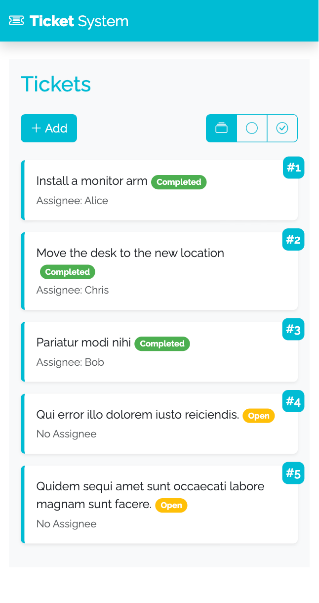
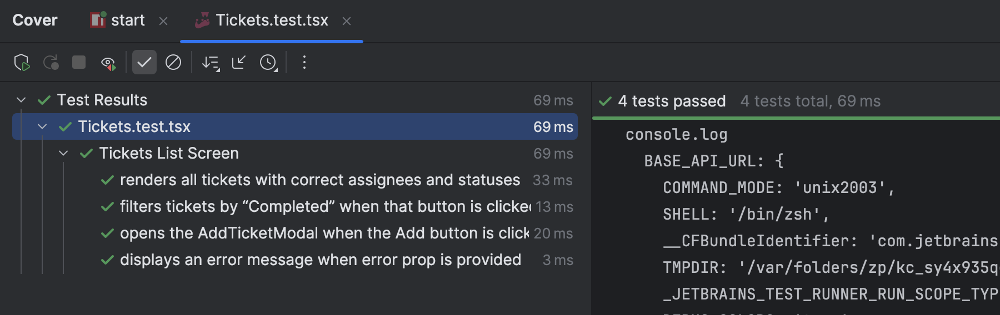
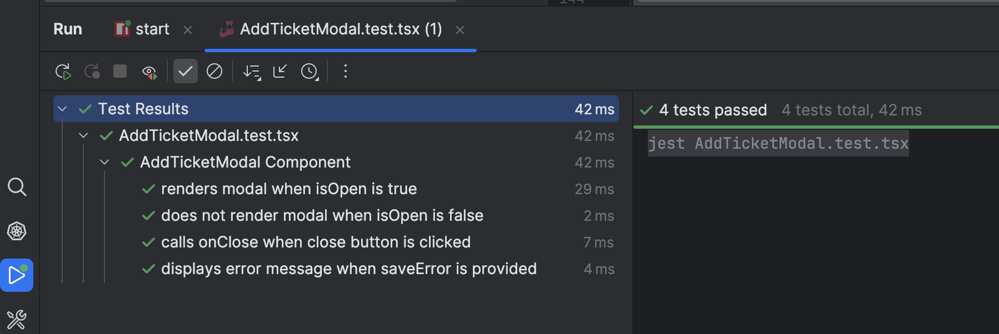

# Ticket Management App

## I. Live Demo

- **Frontend:** https://ticket-system-ldh.web.app/  
  (Deployed via Firebase Hosting)  
- **Backend:** https://ticket-system-ldh-a96486055de3.herokuapp.com/api
  (Deployed on Heroku)

---

## II. System Requirements (SRS)

**Objective:** 
Build a minimal ticket management app, focusing on add, filter, assign, and complete workflows, and deliberate handling of an artificial API delay.

### Core Features

- **Add tickets:** Create new tickets with description.  
- **Filter tickets:** By status (open, completed).  
- **Assign tickets:** Assign to a user.  
- **Complete tickets:** Mark as completed or revert.  

### Screens

- **List Screen** (`/tickets`)  
- **Details Screen** (`/tickets/:id`)  

### **Tech Stack**

- **Frontend:** React + React Router v6 + Redux Toolkit + Styled Components + Bootstrap 5
- **Backend:** NestJS + TypeScript + Artificial API delay on Heroku
- **Monorepo:** Nx workspace managing both FE + BE
- **Testing:** Jest + React Testing Library

---

## III. Software Design & Architecture

### High-Level Architecture

- **Frontend:**  
  - React renders the UI components  
  - Redux & Redux Toolkit manage application state  
  - Services handle API communication  
  - Async thunks manage side effects and async flows (e.g., fetching, saving)  
  - For this app, data is simple enough, so no explicit mapper was implemented for serialization/deserialization
- **Client Routing:** Two main routes using React Router v6:  
  - `/tickets` (list screen)  
  - `/tickets/:id` (details screen)  
- **API Layer:**  
  - REST endpoints for tickets and users, deployed on NestJS backend (Heroku)  

### Race Condition Mitigation

- **Loading flags** (`loadingList`, `loadingDetails`, `saving`) to disable UI during requests.  
- **Stale-request handling:**  “always latest wins” behavior by adding a request-ID guard in the slices

### **Notes**:

- .env are included for demo purpose.

---

## IV. Test Cases

- ✅ = Implemented
- ⏳ = Not Implemented (Pending)

## 1. Tickets List Screen

| **Test ID** | **Priority** | **Test Scenario**                          | **Test Steps / Actions**                              | **Expected Outcome**                                         | **Status** |
| ----------- | ------------ | ------------------------------------------ | ----------------------------------------------------- | ------------------------------------------------------------ | ---------- |
| TC-001      | High         | Render all tickets with details            | Render `<Tickets>` with sample tickets                | Ticket descriptions, assignee names, and statuses appear correctly | ✅          |
| TC-002      | High         | Filter tickets by each filter type         | Click on filter buttons ("All", "Open", "Completed")  | Tickets list updates correctly per selected filter           | ⏳          |
| TC-003      | Medium       | Display error message on tickets list      | Render `<Tickets>` with error prop set                | Error message text is displayed                              | ✅          |
| TC-004      | Medium       | Add button opens AddTicketModal            | Click the "Add" button                                | Add Ticket modal opens                                       | ✅          |
| TC-005      | Low          | Disabled Add button when loading or saving | Set `loading` or `isSaving` state, check "Add" button | Button is disabled                                           | ⏳          |

## 2. Add Ticket Modal

| **Test ID** | **Priority** | **Test Scenario**                             | **Test Steps / Actions**                         | **Expected Outcome**                                       | **Status** |
| ----------- | ------------ | --------------------------------------------- | ------------------------------------------------ | ---------------------------------------------------------- | ---------- |
| TC-006      | High         | Render Add Ticket modal when `isOpen` is true | Render `<AddTicketModal>` with `isOpen=true`     | Modal dialog with title “Add New Ticket” is shown          | ✅          |
| TC-007      | High         | Submit button disabled if empty description   | Render modal with empty description              | Submit button disabled                                     | ✅          |
| TC-008      | Medium       | Do not render Add Ticket modal when closed    | Render `<AddTicketModal>` with `isOpen=false`    | Modal is not present in the DOM                            | ✅          |
| TC-009      | Medium       | Close Add Ticket modal on close button click  | Click the modal’s close button                   | `onClose` handler is called                                | ✅          |
| TC-010      | Medium       | Cancel button triggers onClose                | Click "Cancel" button                            | onClose handler called                                     | ✅          |
| TC-011      | Medium       | Limits description input length               | Enter text longer than 100 characters            | Input truncated at 100 chars                               | ⏳          |
| TC-012      | Low          | Escape key closes modal if not saving         | Press Escape key while modal open and not saving | Modal closes                                               | ⏳          |
| TC-013      | Low          | Submitting AddTicketModal triggers submit     | Fill description, submit form                    | Dispatch createTicketThunk called, modal closes on success | ⏳          |

## 3. Ticket Details Screen

| **Test ID** | **Priority** | **Test Scenario**                     | **Test Steps / Actions**                                 | **Expected Outcome**                                         | **Status** |
| ----------- | ------------ | ------------------------------------- | -------------------------------------------------------- | ------------------------------------------------------------ | ---------- |
| TC-014      | High         | Load ticket data and show form fields | Navigate to ticket details page with valid ticket ID     | Form shows ticket description, assignee dropdown, completed checkbox | ⏳          |
| TC-015      | Medium       | Show loading, error, empty states     | Simulate loading, API error, and no ticket found states  | Loading spinner, error alert, or empty view rendered accordingly | ⏳          |
| TC-016      | High         | Save updates dispatch correct thunks  | Change assignee and/or completion status, click "Update" | Correct assign/unassign and complete/incomplete thunks are dispatched | ⏳          |

### Tests Screenshots

## V. Improvement Proposal

If given more time to enhance this app, I would focus on:

- **Progressive Web App (PWA) support:**  
  Enable installation and offline capabilities for a native app-like experience.

- **State Persistence:**  
  Integrate `redux-persist` to cache Redux state in local storage, improving load times and offline usability.
